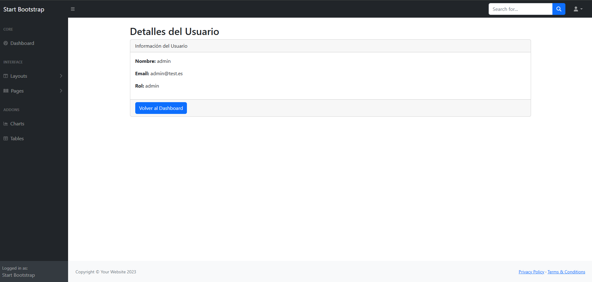

# Proyecto Laravel

Este es un proyecto Laravel que incluye funcionalidades de gestión de usuarios, verificación de correo electrónico, y más.

## Requisitos

- PHP >= 8.2
- Composer

## Instalación

1. Clona el repositorio:
   ```sh
   git clone https://github.com/IsmaelManz26/userManagementApp.git
   cd userManagementApp
   ```

2. Instala las dependencias de PHP:
   ```sh
   composer install
   ```

3. Copia el archivo `.env.example` a `.env` y configura tus variables de entorno:
   ```sh
   cp .env.example .env
   ```

4. Genera la clave de la aplicación:
   ```sh
   php artisan key:generate
   ```

5. Configura la base de datos en el archivo `.env` y luego ejecuta las migraciones:
   ```sh
   php artisan migrate
   ```

## Funcionalidades

- **Gestión de Usuarios**: Crear, editar y eliminar usuarios.
- **Verificación de Correo Electrónico**: Verifica la dirección de correo electrónico de los usuarios.
- **Restablecimiento de Contraseña**: Permite a los usuarios restablecer su contraseña.
- **Dashboard**: Muestra un panel de control con información relevante.

## Estructura del Proyecto

- **Controllers**: Controladores de la aplicación.
- **Models**: Modelos de Eloquent.
- **Views**: Vistas de Blade.
- **web.php**: Rutas web de la aplicación.
- **Public**: Archivos públicos como CSS, JS, imágenes, etc.

## Configuración de Correo

Asegúrate de configurar las variables de entorno para el correo en tu archivo `.env`:

```env
MAIL_MAILER=smtp
MAIL_HOST=smtp.gmail.com
MAIL_PORT=587
MAIL_USERNAME=tu-email@gmail.com
MAIL_PASSWORD=tu-contraseña
MAIL_ENCRYPTION=tls
MAIL_FROM_ADDRESS=tu-email@gmail.com
MAIL_FROM_NAME="${APP_NAME}"
```

## Licencia

Este proyecto está licenciado bajo la Licencia MIT. Consulta el archivo LICENSE para más detalles.

## Capturas de Pantalla

A continuación se muestran algunas capturas de pantalla de la aplicación:

### Página de Inicio de Sesión


### Dashboard



### Gestión de Usuarios


### Perfil

